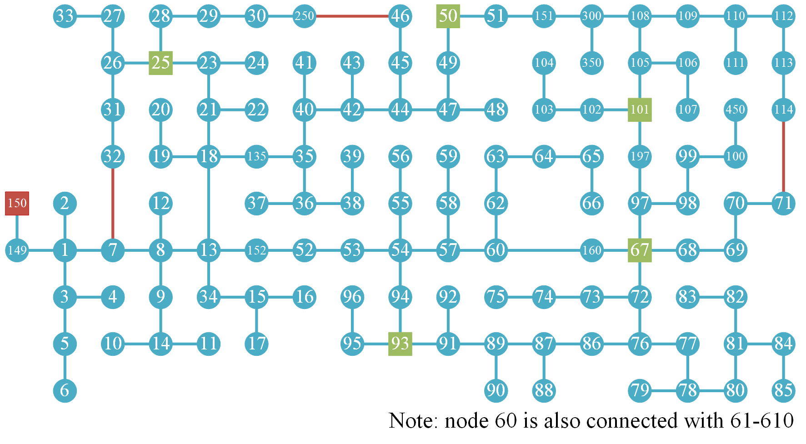
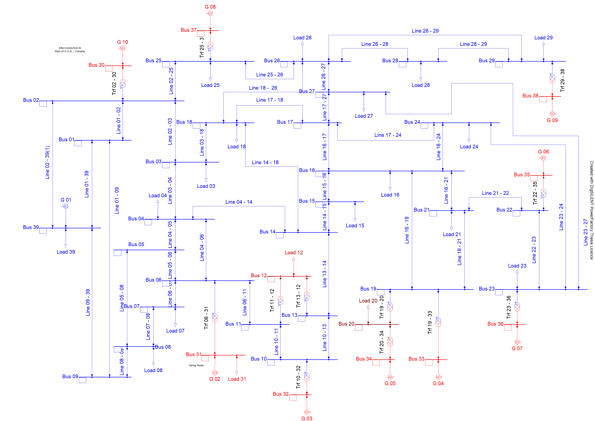
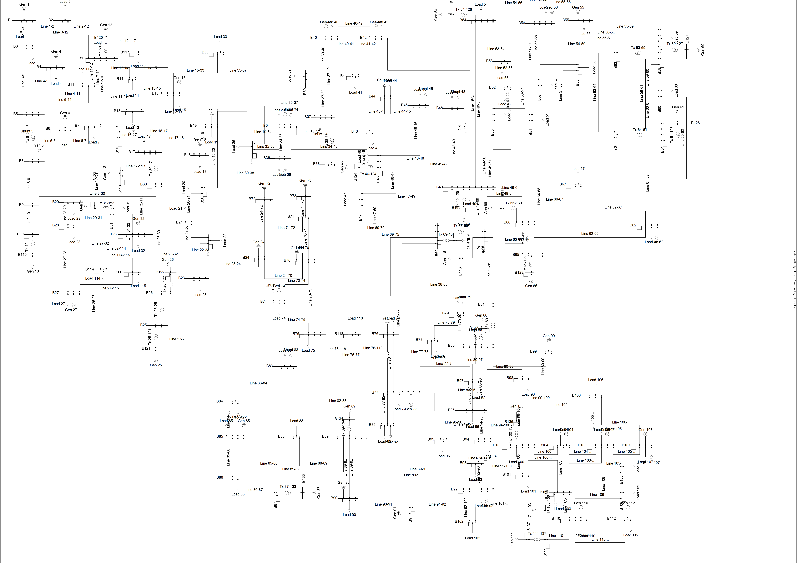

## DNR case with the modified IEEE 123-bus distribution network

The formulation of DNR here is the same as that for the modified IEEE 33-bus system. The modified IEEE 123-bus distribution network is obtained based on the [original data](https://cmte.ieee.org/pes-testfeeders/wp-content/uploads/sites/167/2017/08/feeder123.zip) with the following changes: 

- Three lines, i.e., 7-32, 46-250, and 71-114, are added. All these lines are with the The lengths of these lines are all 300 ft., with configuration 1. 

- Four nodes, i.e., 25, 50, 67, 93, and 101, connect with PV inverters whose power outputs are optimized together with network reconfiguration.

- The network is assumed to be three-phase balanced. Specifically, all line configurations and shunt capacitors are changed to three-phase. All loads are changed to three-phase balanced, by setting the load of each phase to the largest one among the three phases. All lines are changed to three-phase balanced, by setting the impedance of each phase to that of phase A.

- Some missing data, such as line capacities and voltage bounds, is added. See the [data file](./case_123.py) in the [pypower format](https://github.com/rwl/PYPOWER/blob/master/pypower/caseformat.py) for details.

   

In addition, the undertainty set   is defined by , , , , and the optimization model of DNR is feasible in terms of solving by both heuristics in [17] and [19].

## OTS case with the modified IEEE 39-bus system and the IEEE 118-bus system

The formulation of OTS here the same as that for the German transmission network. The modified IEEE 39-bus system is obtained by adding 7 lines, i.e., 1-9, 4-6, 14-18, 17-24, 19-21, and 23-27, to the [original system](https://github.com/rwl/PYPOWER/blob/master/pypower/case39.py). For both of the modified IEEE 39-bus system and the IEEE 118-bus system, all lines are assumed to be switchable; only dynamics of synchronous generators, modelled by the 3-order model equipped with an automatic voltage regulator, are considered; and all loads are static loads. For detailed system parameters, see the PowerFactory files [IEEE-39-bus.pfd](./IEEE-39-bus.pfd) and [IEEE-118-bus.pfd](./IEEE-118-bus.pfd).

In addition,  is the same as that in the OTS case for the German transmission network. The sample set of  is generated in the same way as that in the German network case. The time series dataset used for the generation here is given by [case39_time_series.csv](./case39_time_series.csv) and [case118_time_series.csv](./case118_time_series.csv), which are synthetically generated based on the time series load data of the German transmission network. 

   

   

