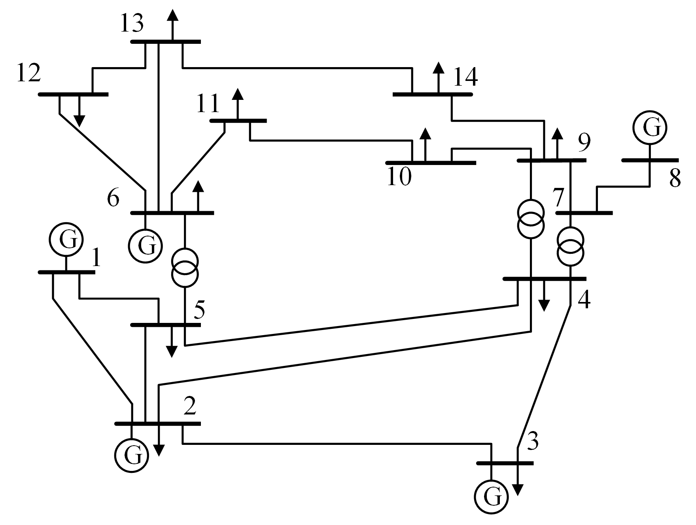
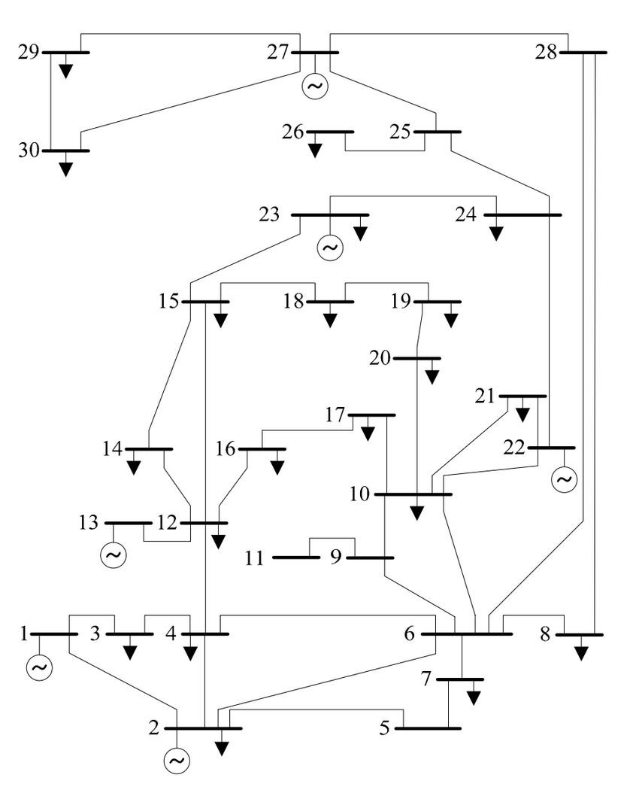
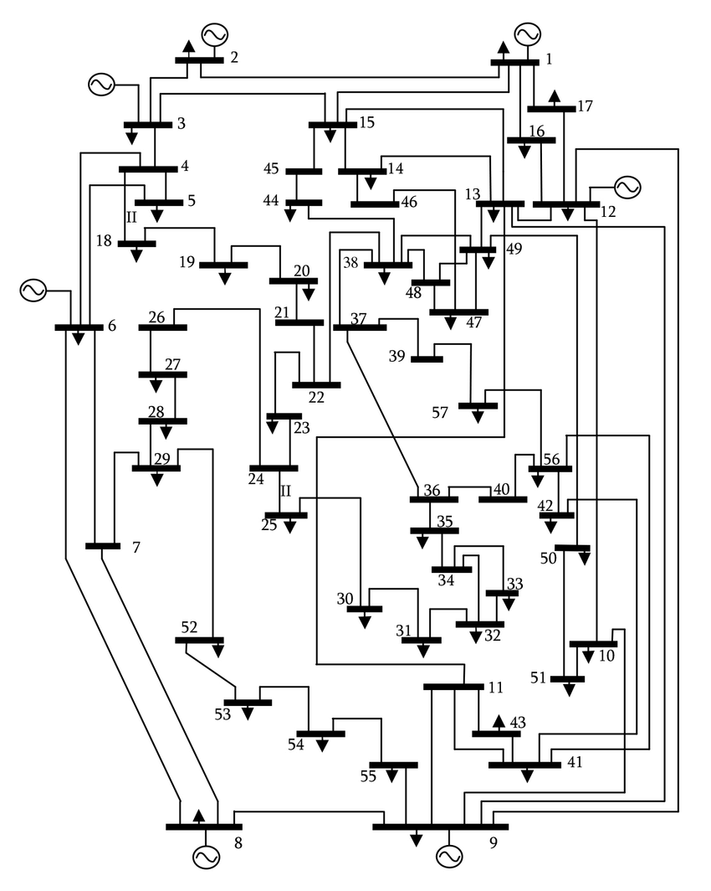
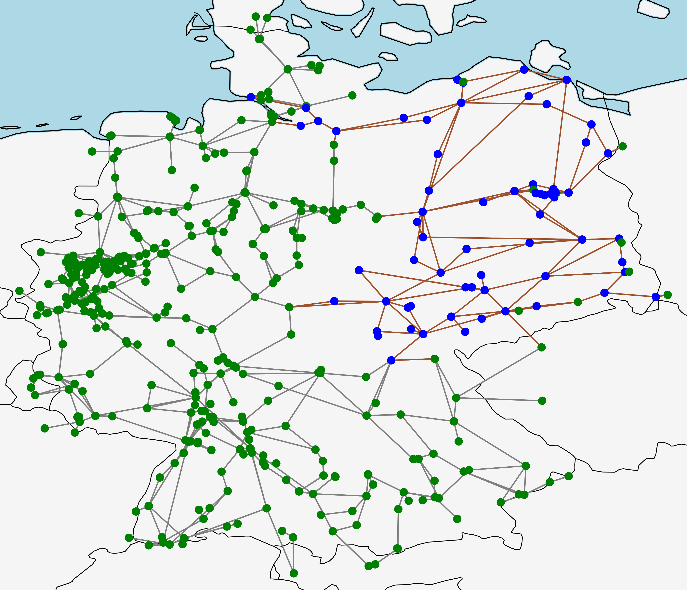
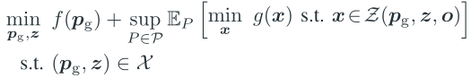
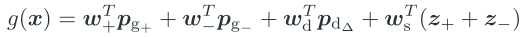
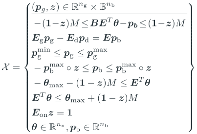
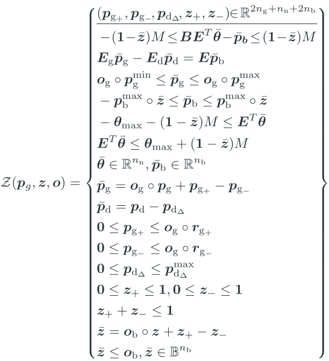

## Case data

Four transmission networks are used for the case study, i.e., the IEEE 14-bus system, IEEE 30-bus system, IEEE 57-bus system, and 50Hertz control area of German transmission network (DE-50Hz). The DE-50Hz system is the 380 and 220 kV transmission network in the north-eastern Germany that is controlled by operator 50Hertz. We use the system data of German transmission network from [SciGRID](https://www.pypsa.org/examples/scigrid-lopf-then-pf.html), where the DE-50Hz system contains 76 buses, 166 lines, 16 transformers, and 265 generators. Detailed system data is given by [case14.py](./case14.py), [case30.py](./case30.py), [case14.py](./case57.py), and [case_de.py](./case_de.py), which are fomred by augmenting the [initial pypower data](./initial) with extra parameters for security-constrained optimal transmission switching problems (SCOTS) and the contingency set used for stochastic SCOTS. Please see [caseformat.py](./caseformat.py) for details on the case file format. 

   
   

## Example of SCOTS formulation using the DC power flow model

The two-stage DR formulation of SCOTS can be written as 

   

where , and the first and second stages are the dispatch problem under the normal state and corrective control problem after a contingency, respectively. The first-stage objective function  is the total generation cost, which is linearized using the ``'' approximation in [1]. The second-stage objective function  is the total cost of generator regulation, load shedding and corrective line switching, given by

   

By adopting the DC power flow model, the first-stage feasible region

   

which is defined by power flow and power balance constraints, and bound constraints of power outputs of generators, branch powers, and angle differences of branches. 
The second-stage feasible region 

   

which is defined by the constraints analogous to those in  but for the post-control system, bound constraints for regulation of generators and load shedding, constraints for switching actions, and constraints connecting topology, switching actions and branch contingencies. 

Notations used in the above formulation are listed in the following table (bold lowercase letters are all vectors with proper dimension):
|   |   |
|---|---|
|| Big-M constant.
|| Numbers of buses, generators, and branches.
|| Active power outputs of generators and the counterpart of  for the post-control system.
|| Active load powers and the counterpart of  for the post-control system.
|| Active powers of branches and the counterpart of  for the post-control system.
|| Voltage phase angles of buses and the counterpart of  for the post-control system.
|| Statuses of branches where entry values of 1/0 denote the associated branches are switched on/off, counterpart of  for the post-control topology.
|| Maximum active power outputs of generators. 
|| Maximum phase angle difference of branches.
|| Power capacity of branches.
|| Upward/downward regulations of active power outputs of generators. 
|| Upward/downward ramp rate of generators.
|| Amount of load shedding and its upper bound.
|| Action signs of switching on/off branches. An entry value of 1/0 means a/no switching action performed.
|| Parameterization of N-k contingencies. Entry values of 1/0 indicate the normal/failure state of components.
|| Sub-vectors of  for generators and branches.
|| Feasible region of the first/second-stage problem.
|| Incidence matrix between buses and generators.
|| Incidence matrix between buses and loads.
|| Oriented incidence matrix of the underlying graph of the transmission network with each branch assigned arbitrary and fixed orientation.
|| Diagonal matrix formed by susceptance of each branch
|| The first-stage and second-stage functions.
|| Probability distribution of  and its ambiguity set.

 

[1] C. Coffrin, B. Knueven, J. Holzer, and M. Vuffray, “The impacts of convex piecewise linear cost formulations on AC optimal power flow,” Electric Power Systems Research, vol. 199, p. 107191, Oct. 2021.

