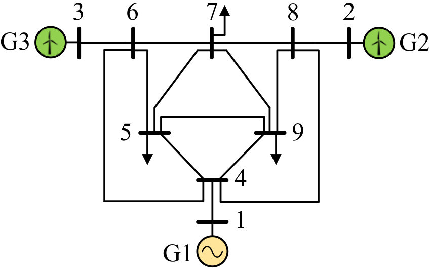
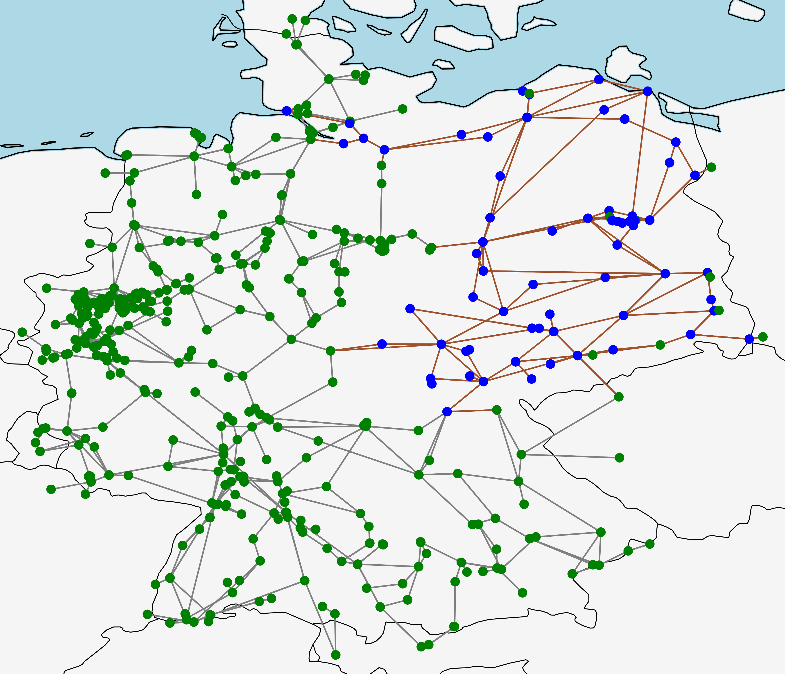
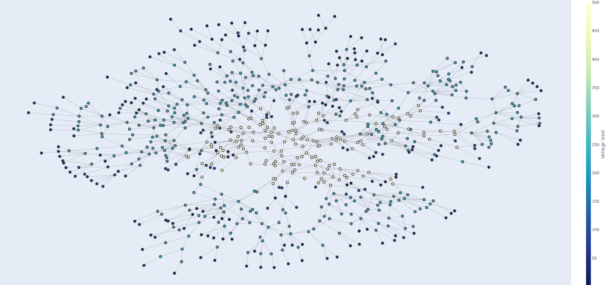

## The modified IEEE 9-bus system

This system is obtained from the original IEEE 9-bus system by adding 5 lines, and replacing the conventional generators at bus 2 and 3 with wind turbines. Capacity of lines 1-4, 3-6, and 8-2 are increased by 3 times to ensure operational feasibility under various scenarios. We randomly generate 500 different scenarios of load power at buses 5, 7 and 9 and forecast values of the maximal active power outputs of G2 and G3. Data of this system can be found [here](./case-9-modified).

   

|File                                                 |Content |
|-----                                                |--------|
|[case9.py](./case-9-modified/case9.py)|Data for the modified IEEE 9-bus system. Please see [caseformat.py](./caseformat.py) for details on the case file format. |
|[p_gen_max_pu.csv](./case-9-modified/p_gen_max_pu.csv)|Scenario data for the maximal active power outputs (in p.u.) of generators G2 and G3.|
|[p_load_pu.csv](./case-9-modified/p_load_pu.csv)   |Scenario data for active load power.|
|[q_load_pu.csv](./case-9-modified/q_load_pu.csv)   |Scenario data for reactive load power. |

##  The 50Hertz control area of the German transmission (DE-50Hz) network

The DE-50Hz system is the 380 and 220 kV transmission network in the north-eastern Germany that is controlled by operator 50Hertz. We use the system data of German transmission network from [SciGRID](https://www.pypsa.org/examples/scigrid-lopf-then-pf.html), where the DE-50Hz system contains 76 buses, 166 lines, 16 transformers, 93 conventional generators, 87 wind farms and 85 solar farms. The DE-50Hz system is colored in red and blue in the diagram of the German transmission network below. Data of the system can be found [here](./case-de).

   

|File                                                 |Content |
|-----                                                |--------|
|[case_de_47.py](./case-de/case_de_47.py)|Data for the DE-50Hz system under the 1-th time-series scenario. Please see [caseformat.py](./caseformat.py) for details on the case file format. | 
|[case_de_48.py](./case-de/case_de_48.py)|Data for the DE-50Hz system under the 2-th time-series scenario. Please see [caseformat.py](./caseformat.py) for details on the case file format. | 
|......|...... | 

## The transmission network of Liaoning province in China (LN)

The LN network is the 220kV and 550kV transmission network in Liaoning province in China. The system data and time-series scenarios are taken from 2016. It contains 772 buses, 970 lines (954 220kV and 500kV transmission lines), 143 two-phase transformers, 62 three-phase transformers, 118 conventional generators and 38 wind farms. Notes that some lower-voltage buses are considered to model loads and generators. Data of the system can be found [here](./case-ln). An interactive diagram of the network is given [here](https://htmlpreview.github.io/?https://github.com/thanever/SOC/blob/master/Uncertainty/data/case-ln.html).

 

   

|File                                                 |Content |
|-----                                                |--------|
|[case_ln_75.py](./case-ln/case_ln_75.py)|Data for the LN system under the 1-th time-series scenario. Please see [caseformat.py](./caseformat.py) for details on the case file format. | 
|[case_ln_76.py](./case-ln/case_ln_76.py)|Data for the LN system under the 2-th time-series scenario. Please see [caseformat.py](./caseformat.py) for details on the case file format. | 
|......|...... | 

